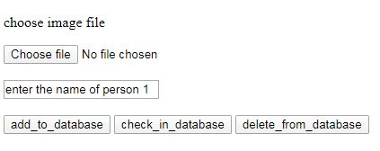
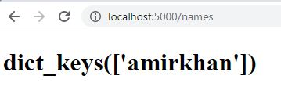

# Facerecognition
face recognition project deployed using flask in tensorflow

## **weights file link** 
https://github.com/rcmalli/keras-vggface/releases/download/v2.0/rcmalli_vggface_tf_notop_resnet50.h5 
save the weights file as face_recognition_model.h5 in directory  

## **libraries recquired**
tensorflow>=2.0.0 , mtcnn , flask , pillow  

## **run app.py** 

 
**to view database go to /names**

