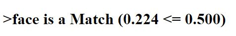

# Facerecognition
face recognition project deployed using flask in tensorflow 
this project is  inspired by https://github.com/rcmalli/keras-vggface implementation 

## **libraries recquired**
tensorflow>=2.0.0 , mtcnn , flask , pillow  

## **run app.py**  

   

## we used cosine distance

